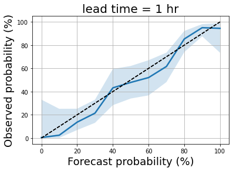

# 氣象局降雨機率預報準確度

透過氣象局 API 取得每日的降雨機率預報以及自動站觀測資料，來探討機率預報的準確度。

* 資料來源：氣象公開資料平台，[F-C0032-001](https://opendata.cwb.gov.tw/dataset/forecast/F-C0032-001)（縣市預報資料）、[O-A0002-001](https://opendata.cwb.gov.tw/dataset/observation/O-A0002-001)（自動雨量站觀測資料）
* 資料時間：2019/08/30 ~ 2020/02/20
* 縣市預報是以該單位縣市政府所在位置為基準（例如：預報臺北市降雨機率80%，是指臺北市政府這個位置有80%的機率降雨），因此觀測資料會以距離縣市政府最近的觀測站為準。
* 準確的機率預報代表：在 n 個降雨機率為 p 的日子中，約有 n\*p 個日子有下雨。例如：假設臺北市降雨機率80%的日子共有 100 天，如果其中有 78 個日子是最終真的有下雨，那表示預報算準確；但若最後只有 50 個日子下雨，那表示預報失準，預報機率過高。
* 主要分析每日早上 5 點發布的預報，預報的區段為當天 6 點至 18 點（lead time = 25 小時），以及隔日的 6 點至 18 點（lead time = 25 小時）。

## 結果
（黑色虛線為 y = x 的斜直線，藍色線是預報機率和實際降雨機率的線，藍色線越接近黑色虛線表示預報越準）
  
